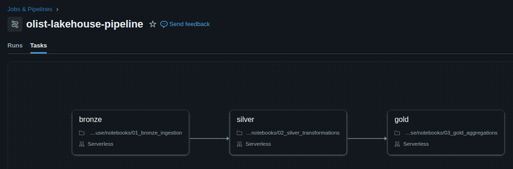
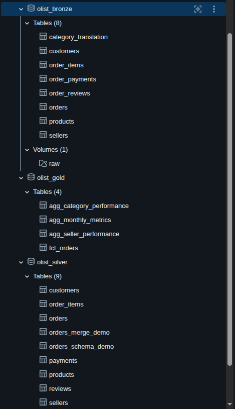
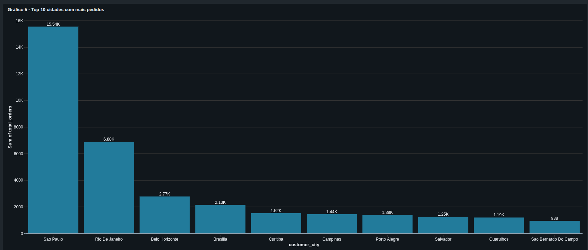

# Olist Lakehouse

ELT pipeline on the [Olist Brazilian E-Commerce](https://www.kaggle.com/datasets/olistbr/brazilian-ecommerce) dataset (~100K orders, 2016-2018). Built with PySpark, Delta Lake, and Databricks Free Edition.

The pipeline follows a medallion architecture: Bronze (raw CSVs), Silver (cleaned and typed), Gold (aggregated business metrics). All tables are Delta format under Unity Catalog.

## How it works

1. 9 CSV files are uploaded to a Databricks Volume
2. Bronze reads them with explicit `StructType` schemas and saves as Delta tables
3. Silver cleans timestamps, deduplicates reviews, standardizes text, adds calculated columns
4. Gold creates a fact table (`fct_orders`) and 3 aggregation tables (monthly, seller, category)
5. 24 data quality checks validate the Silver layer (all pass)
6. A separate notebook demos Delta features: MERGE, Time Travel, Schema Enforcement, OPTIMIZE, VACUUM

Orchestration is a Lakeflow Job chaining bronze → silver → gold. A Databricks AI/BI Dashboard has 7 charts covering revenue trends, delivery performance, seller quality, and category rankings.

### Lakeflow Job



### Unity Catalog



### Dashboard (top 10 cities by orders)



## Tech stack

Databricks Free Edition, PySpark, Delta Lake, Unity Catalog, Lakeflow Jobs, Python 3.13

## Running it

You need a Databricks account (Free Edition works) and the Olist dataset from Kaggle.

1. Connect this repo as a Git Folder in Databricks
2. Upload the 9 CSVs to `/Volumes/workspace/olist_bronze/raw`
3. Run the notebooks in order: `00_setup` → `01_bronze` → `02_silver` → `03_gold`
4. Run `tests/data_quality_checks.py` to validate
5. Or just trigger the Lakeflow Job for steps 3-4

## Project structure

```
olist-lakehouse/
├── notebooks/
│   ├── 00_setup.py                  # schemas, constants, volume validation
│   ├── 01_bronze_ingestion.py       # CSV → Bronze Delta tables
│   ├── 02_silver_transformations.py # cleaning, dedup, type casting
│   ├── 03_gold_aggregations.py      # fact table + 3 aggregations
│   └── 04_delta_features_demo.py    # MERGE, Time Travel, OPTIMIZE, VACUUM
├── includes/
│   └── schema.py                    # StructType definitions for all 8 CSVs
├── tests/
│   └── data_quality_checks.py       # 24 automated checks on Silver
└── data/                            # CSV files (not committed)
```